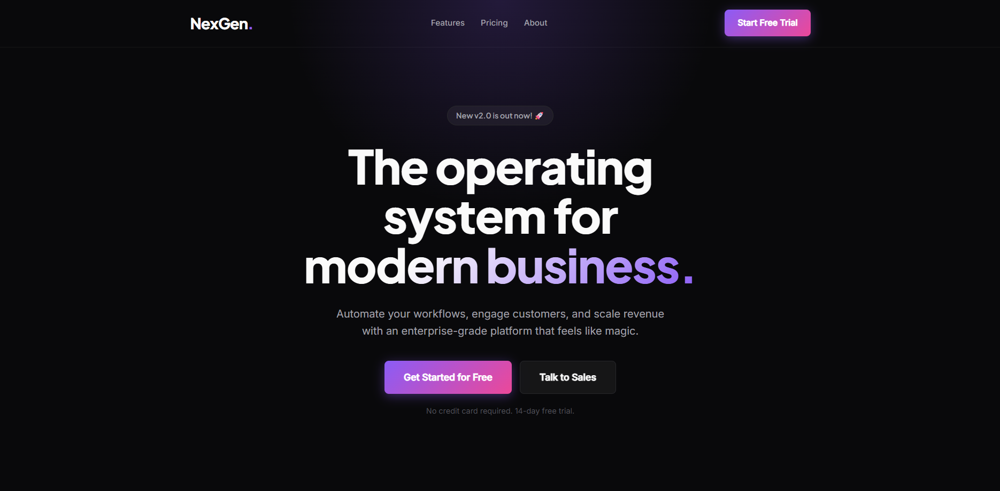

# Modern SaaS Landing Page 🚀

Uma landing page moderna, responsiva e com foco em conversão, ideal para produtos SaaS (Software as a Service) ou startups de tecnologia. Desenvolvida com HTML5 semântico e CSS3 puro, sem dependência de frameworks.

## ✨ Destaques do Projeto

- **Design Premium**: Tema escuro (Dark Mode) com efeito *glassmorphism* e brilhos de fundo (*ambient glow*).
- **Tipografia Moderna**: Utilização das fontes `Plus Jakarta Sans` e `Inter` para máxima legibilidade e estética elegante.
- **Responsivo**: Layout fluido que se adapta perfeitamente a dispositivos móveis, tablets e desktops usando CSS Flexbox e Grid.
- **Micro-interações**: Efeitos suaves de *hover* nos botões e cartões de features.

<div align="center">
  
</div>

## 🛠️ Tecnologias Utilizadas

- **HTML5** (Semântico)
- **CSS3** (Variáveis, Flexbox, CSS Grid, Gradientes e Filtros)

## 💻 Como Visualizar Localmente

Não há processo de *build* necessário. Basta abrir o arquivo localmente no seu navegador:

1. Clone o repositório:
   ```bash
   git clone https://github.com/gbit-dev/modern-landing-page.git
   ```
2. Abra o arquivo `index.html` em qualquer navegador.
   *(Se preferir, use uma extensão como o "Live Server" no VS Code para uma melhor experiência).*

## 📝 Estrutura do Código

- `index.html`: Toda a estrutura semântica da página (Hero, Features, Footer).
- `style.css`: Estilização completa, contendo todas as variáveis de cores (`:root`) no topo do arquivo para fácil personalização da marca.

---
Desenvolvido com 💙 e código limpo.
